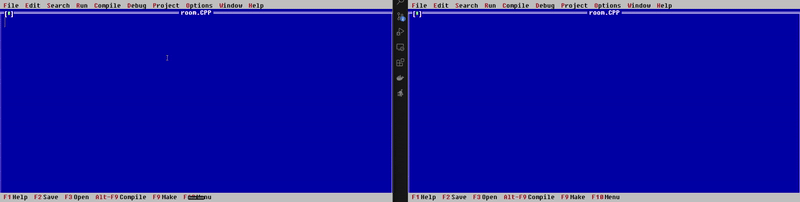

 <h1> Paste Copy </h1>

<b>Paste Copy</b> é uma aplicação <i>web</i> onde você pode copiar, colar ou transferir qualquer tipo de texto para outro dispositivo <i>on-line</i>. Qualquer pessoa pode copiar e colar qualquer conteúdo sem ID de <i>login</i> ou nenhum aplicativo é necessário.

Quando editadas as mensagens são atualizadas simultaneamente em todos os dispositivos conectados. Você pode criar notas com base no <code>path</code> e basta copiar e compartilhar esse mesmo nome para que qualquer outra pessoa para ter acesso ao texto em questão.

