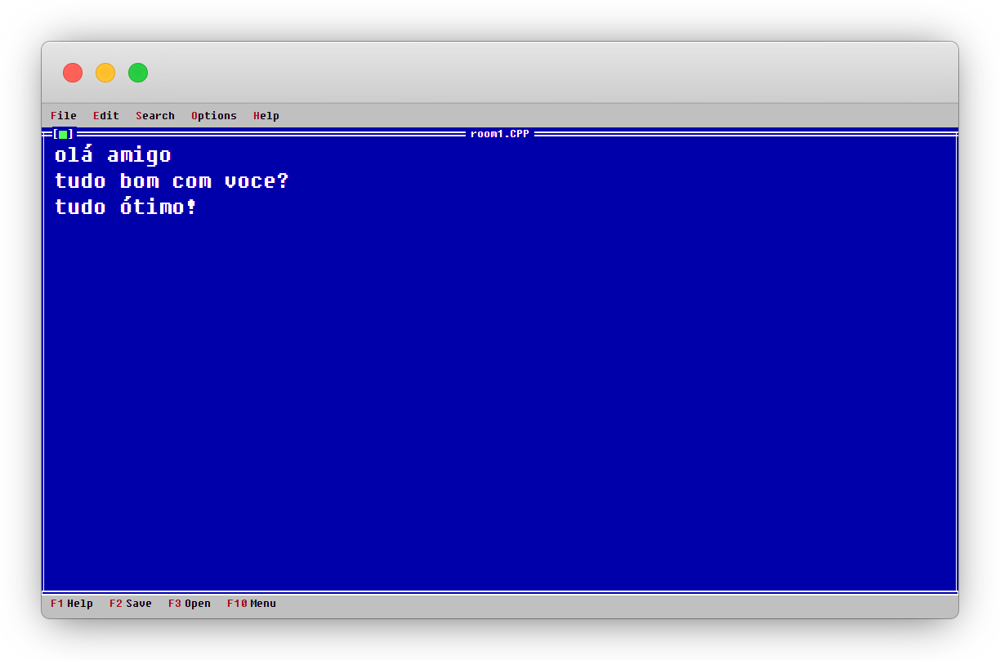

# Interface Web 

Interface web escrita em React para a aplicação **Paste Copy**.

<p align="center">
  
</p>


## Como rodar localmente?

> [!IMPORTANT]
> Para executar essa aplicação é ncessário ter o **nodejs** instalado na máquina.

Primeiro passo é instalar as dependências do projeto:

```bash
npm i
```

Na sequência já executar a aplicação:

```bash
npm run dev
```

> [!TIP]
> Certifique-se de que o backend também está rodando para que funcione corretamente. Para mais informações consultar [esta documentação](../server/README.md#como-rodar-localmente).

A aplicação por default roda localmente (`127.0.0.1`, `localhost`) na porta `5173`, você pode acessar utilizando a url [http://localhost:5173/nome-da-sala](http://localhost:5173/nome-da-sala).